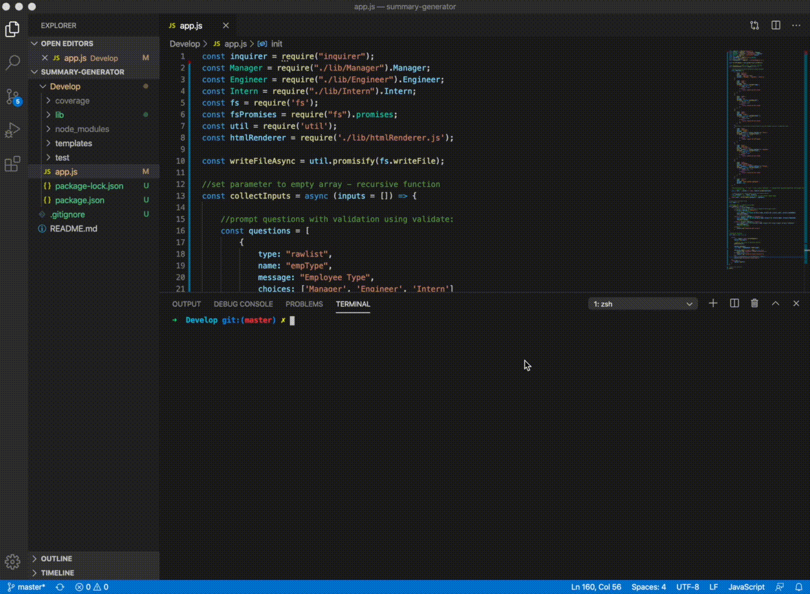
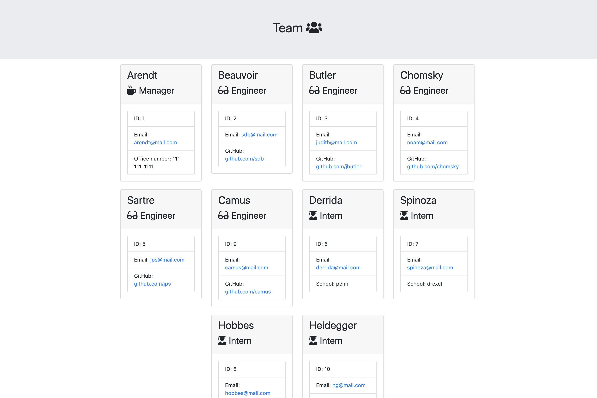
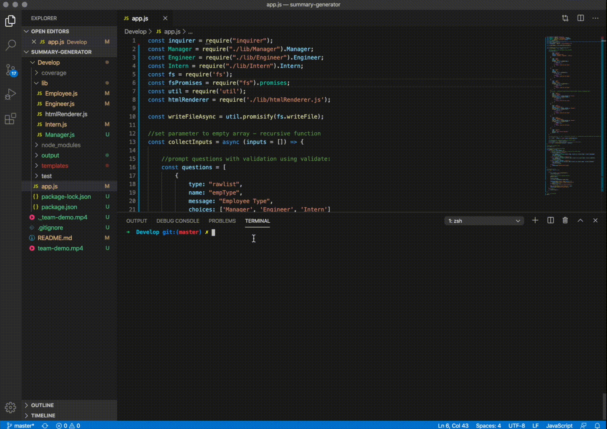
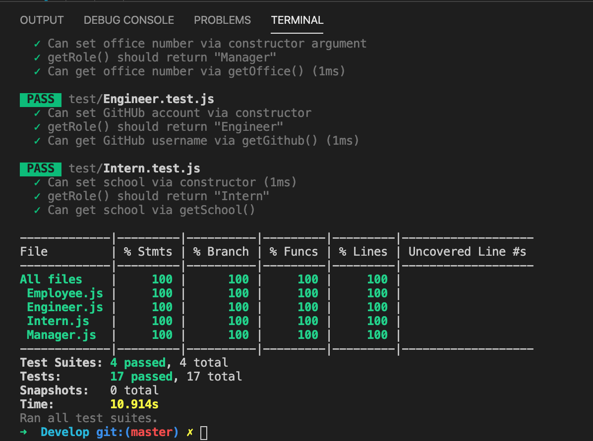

# **Team.html** summary-generator


## Tech
* Node.js
* inquirer
* fs + fsPromises
* util

## Process
1. Defined and exported Employee class based on Employee.tests.js
2. Defined and exported Manager, Engineer, and Intern classes - inherit from Employee class - based on respective tests.js provided
3. Confirm all jest tests passed
4. Created list of questions to prompt user using inquirer.prompt (with validation + conditional prompts based on previous input)
5. Set up functions to collect input, create instances of class, create folder/write file - call functions within init();
6. Edit html/css to align cards

## Usage

Install dependencies
```
npm i
```
Run app.js
```
node app.js
```
Run tests
```
npm run test
```

## Demo 






